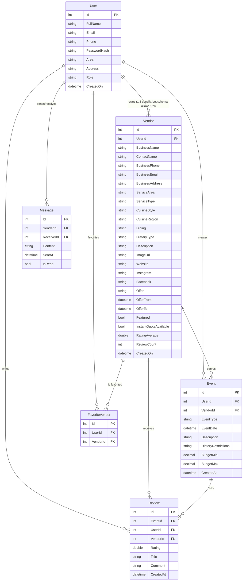

# Database Schema Documentation

This document outlines the database schema for the WebAPI project, derived from the C# models in `WebAPI/WebApi/Models`.

## Entity Relationship Diagram (ERD)

## Table Details

### 1. Users
Stores all system users, including Customers, Vendors, and Admins.
- **Id** (`int`, PK): Unique identifier.
- **FullName** (`string`): User's full name.
- **Email** (`string`): User's email address (Unique).
- **Phone** (`string`): Contact number.
- **PasswordHash** (`string`): Securely hashed password.
- **Area** (`string`): General area/region.
- **Address** (`string`): Full address.
- **Role** (`string`): User role (`Customer`, `Vendor`, `Admin`).
- **CreatedOn** (`DateTime`): Account creation timestamp.

### 2. Vendors
Stores profile information for users who are vendors. Linked to `Users` table.
- **Id** (`int`, PK): Unique identifier.
- **UserId** (`int`, FK): Links to the `Users` table.
- **BusinessName** (`string`): Name of the vendor's business.
- **ContactName** (`string`): Primary contact person.
- **BusinessPhone** (`string`): Business contact number.
- **BusinessEmail** (`string`): Business email.
- **BusinessAddress** (`string`): Physical address of the business.
- **ServiceArea** (`string`): City or region served (e.g., Toronto, Mississauga).
- **ServiceType** (`string`): Type of service (e.g., Catering, Rentals).
- **CuisineStyle** (`string`): Style of food (e.g., BBQ, Buffet).
- **CuisineRegion** (`string`): Regional cuisine (e.g., Italian, Indian).
- **Dining** (`string`): Dining style (e.g., Live Cooking, Delivery).
- **DietaryType** (`string`): Dietary options (e.g., Vegan, Halal).
- **Description** (`string`): Business description.
- **ImageUrl** (`string`): URL to vendor's profile image.
- **Website** (`string`): External website URL.
- **Social Media**: `Instagram`, `Facebook` links.
- **Offers**: `Offer` (text), `OfferFrom` (date), `OfferTo` (date).
- **Status Flags**: `Featured`, `InstantQuoteAvailable`.
- **Stats**: `RatingAverage`, `ReviewCount` (likely aggregated).
- **CreatedOn** (`DateTime`): Profile creation timestamp.

### 3. Events
Stores events created by users that may be linked to a vendor.
- **Id** (`int`, PK): Unique identifier.
- **UserId** (`int`, FK): The user who created the event.
- **VendorId** (`int`, FK): The vendor assigned to the event (if any).
- **EventType** (`string`): Type of event (e.g., Wedding, Corporate).
- **EventDate** (`DateTime`): Date of the event.
- **Description** (`string`): Details about the event.
- **DietaryRestrictions** (`string`): Specific dietary needs.
- **Budget**: `BudgetMin`, `BudgetMax` (decimal).
- **CreatedAt** (`DateTime`): Record creation timestamp.

### 4. Messages
Stores chat messages between users (typically Customer <-> Vendor).
- **Id** (`int`, PK): Unique identifier.
- **SenderId** (`int`, FK): User ID of the sender.
- **ReceiverId** (`int`, FK): User ID of the receiver.
- **Content** (`string`): Message body.
- **SentAt** (`DateTime`): Timestamp.
- **IsRead** (`bool`): Read status.

### 5. Reviews
Stores reviews left by users for vendors regarding specific events.
- **Id** (`int`, PK): Unique identifier.
- **EventId** (`int`, FK): The event being reviewed.
- **UserId** (`int`, FK): The user writing the review.
- **VendorId** (`int`, FK): The vendor being reviewed.
- **Rating** (`double`): Numeric rating (supports half-stars).
- **Title** (`string`): Review title.
- **Comment** (`string`): Review content.
- **CreatedAt** (`DateTime`): Timestamp.

### 6. FavoriteVendors
Join table for users' favorite vendors.
- **Id** (`int`, PK): Unique identifier.
- **UserId** (`int`, FK): The user.
- **VendorId** (`int`, FK): The favorited vendor.
